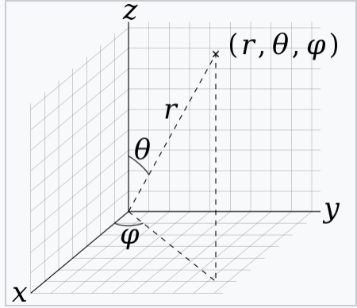

## Project  Plan (2023/12/15-2023/1/31)

### Main Target: construct 3D model simulator with no constraint

> [!NOTE]
> ps: no constraint means the rods only affect by gravity and external torque induced by magnetic field and don't consider vessel wall at all

      
#### Sub-Targets  
  - [ ] Investigate python packages or softwares that can visualize 3D data which generated by PyElastica (Deadline 12/22)
  - [ ] Investigate the control methods used in industry.(Deadline 12/22)
  - [ ]  Extend M_rod_actuator_electromagnet.py from 2D to 3D, notice that now there are two angles to rotate. They are polar angle $\theta$, azimuth angle $\phi$ (Plz follow the notation).   
  - [ ]  Collect data from Ansys (Deadline 12/22)
  - [ ]  Extend uniform magnetic fields to blocks of uniform magnetic fields and update to our 3D simulator.